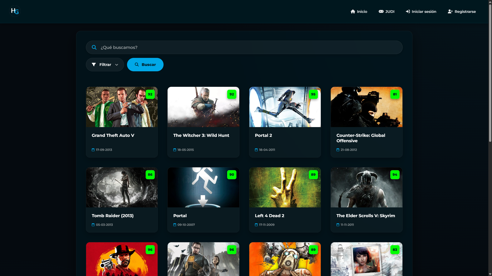
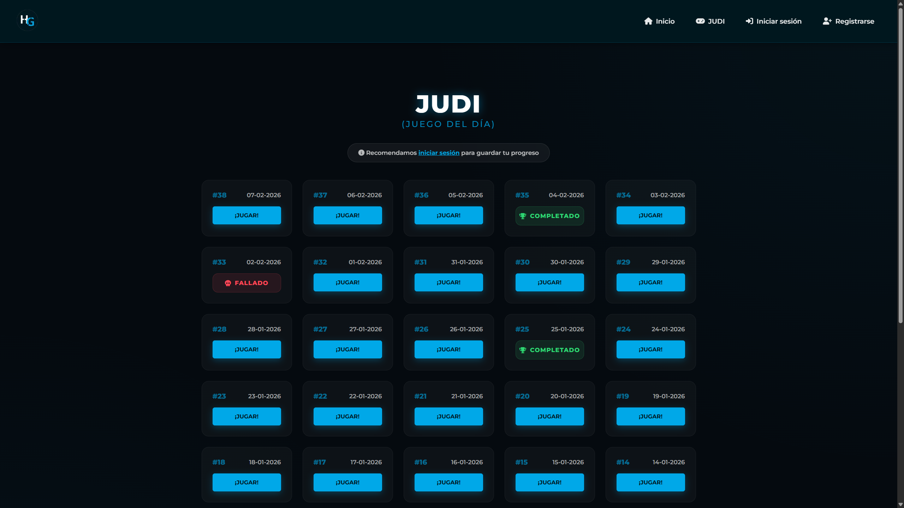
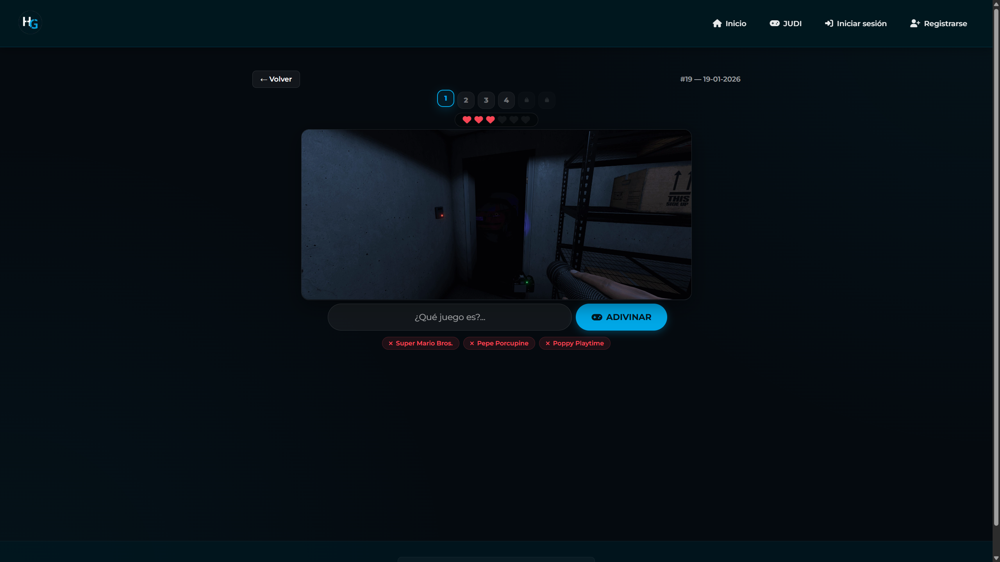
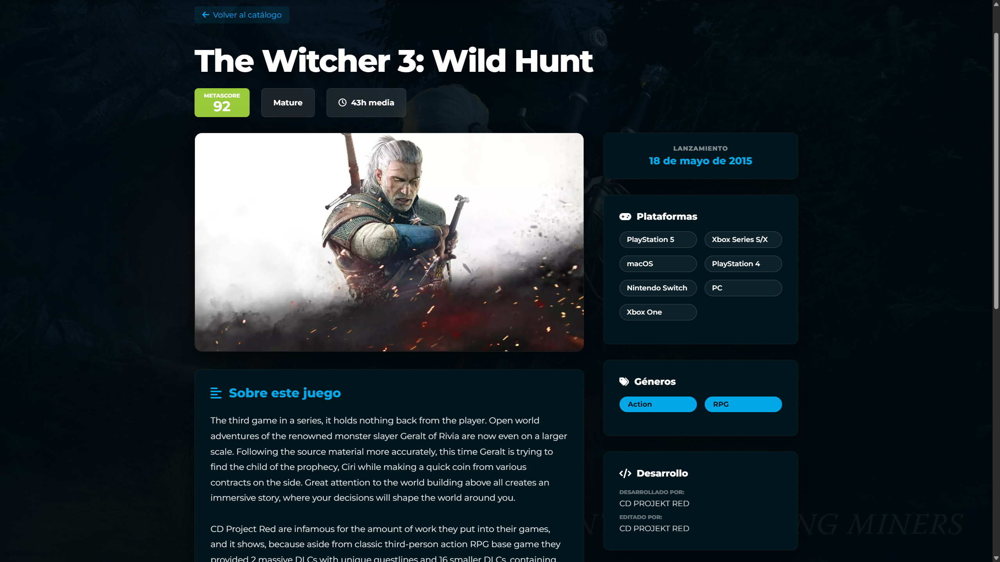
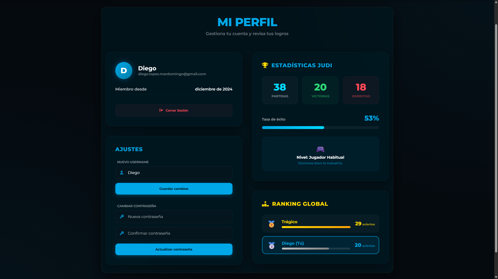

<div align="center">

<!-- Hero Banner -->


# 🎮 HubGames

### *Tu biblioteca gamer definitiva*

**Explora. Descubre. Compite.**

[](https://hub-games.vercel.app/)

<br/>

[](https://nextjs.org/)
[](https://www.typescriptlang.org/)
[](https://supabase.com/)
[](https://tailwindcss.com/)
[](https://web.dev/progressive-web-apps/)
[](https://vercel.com/)
[](https://hub-games.vercel.app/)

<br/>

<p align="center">
  <strong>
    <a href="#-características">Características</a> •
    <a href="#-judi---juego-del-día">JUDI</a> •
    <a href="#-ranking-global">Ranking</a> •
    <a href="#-stack-tecnológico">Stack</a> •
    <a href="#-screenshots">Screenshots</a>
  </strong>
</p>

---

<br/>

</div>

## ✨ Características

<table>
  <tr>
    <td width="50%">
      <h3 align="center">🔍 Buscador Inteligente</h3>
      <p align="center">
        Integrado con la <strong>API de RAWG</strong>, accede a una base de datos masiva con más de <strong>500.000 videojuegos</strong>.
      </p>
      <ul>
        <li>🎯 <strong>Filtros avanzados</strong> por género, plataforma y fecha de lanzamiento</li>
        <li>📸 <strong>Screenshots y galerías</strong> de cada título</li>
        <li>⭐ <strong>Puntuaciones Metacritic</strong> integradas</li>
        <li>🏷️ <strong>Tags, géneros y categorías</strong> detalladas</li>
        <li>📑 <strong>Paginación fluida</strong> para navegar resultados</li>
      </ul>
    </td>
    <td width="50%">
      <h3 align="center">📚 Fichas de Juego Completas</h3>
      <p align="center">
        Información detallada sobre cada juego, directamente desde RAWG.
      </p>
      <ul>
        <li>🖼️ <strong>Imagen principal</strong> y galería de capturas</li>
        <li>📝 <strong>Descripción completa</strong> del juego</li>
        <li>🕹️ <strong>Plataformas disponibles</strong></li>
        <li>🏢 <strong>Desarrolladores y editores</strong></li>
        <li>⏱️ <strong>Tiempo medio de juego</strong> y clasificación ESRB</li>
      </ul>
    </td>
  </tr>
  <tr>
    <td width="50%">
      <h3 align="center">👤 Sistema de Usuarios</h3>
      <p align="center">
        Gestiona tu cuenta y sincroniza tu progreso en la nube.
      </p>
      <ul>
        <li>🔐 <strong>Autenticación segura</strong> (Email + Google OAuth)</li>
        <li>📊 <strong>Estadísticas personales</strong> de JUDI</li>
        <li>🏆 <strong>Tu posición</strong> en el Ranking Global</li>
        <li>⚙️ <strong>Ajustes de cuenta</strong> (username, contraseña)</li>
        <li>☁️ <strong>Sincronización cloud</strong> de progreso</li>
      </ul>
    </td>
    <td width="50%">
      <h3 align="center">📱 Experiencia Móvil (PWA)</h3>
      <p align="center">
        <strong>Progressive Web App</strong> para una experiencia nativa.
      </p>
      <ul>
        <li>📲 <strong>Instalable</strong> en iOS y Android</li>
        <li>🚀 <strong>Modo Standalone</strong> sin barra de navegador</li>
        <li>📶 <strong>Soporte offline</strong> básico con Service Worker</li>
        <li>🔔 <strong>Diseño 100% responsive</strong></li>
        <li>✨ <strong>Interfaz premium</strong> con glassmorphism</li>
      </ul>
    </td>
  </tr>
</table>

<br/>

---

<br/>

<div align="center">

## 🎯 JUDI - Juego Del Día


</div>

<br/>

<div align="center">

### ¿Cuántas pistas necesitas para adivinar el juego?

</div>

<br/>

JUDI es un reto diario para los amantes de los videojuegos. Cada día se selecciona un título y tú debes adivinarlo con el menor número de pistas posible. Cuantas menos pistas uses, ¡más mérito tendrás!

<br/>

<table align="center">
  <tr>
    <td align="center" width="140">
      <h1>🖼️</h1>
      <strong>Fase 1</strong><br/>
      <sub>Screenshot</sub>
    </td>
    <td align="center" width="140">
      <h1>🔥</h1>
      <strong>Fase 2</strong><br/>
      <sub>Popularidad</sub>
    </td>
    <td align="center" width="140">
      <h1>⭐</h1>
      <strong>Fase 3</strong><br/>
      <sub>Metacritic</sub>
    </td>
    <td align="center" width="140">
      <h1>🖥️</h1>
      <strong>Fase 4</strong><br/>
      <sub>Plataformas</sub>
    </td>
    <td align="center" width="140">
      <h1>🏷️</h1>
      <strong>Fase 5</strong><br/>
      <sub>Géneros</sub>
    </td>
    <td align="center" width="140">
      <h1>📅</h1>
      <strong>Fase 6</strong><br/>
      <sub>Lanzamiento</sub>
    </td>
  </tr>
</table>

<br/>

<div align="center">

| 💡 Característica | Descripción |
|:---:|:---|
| **❤️ 6 Vidas** | Cada intento fallido desbloquea una nueva pista visual |
| **☁️ Sincronización** | Progreso guardado en la nube para usuarios registrados |
| **📱 Local Storage** | Los visitantes también pueden jugar sin registrarse |
| **🏆 Historial** | Accede a retos anteriores y revisa tus resultados |
| **🔍 Autocompletado** | Busca entre miles de juegos mientras escribes |

</div>

<br/>

---

<br/>

<div align="center">

## 🏆 Ranking Global


</div>

<br/>

¡Demuestra que eres el mejor conocedor de videojuegos! El **Ranking Global** clasifica a todos los usuarios según sus aciertos en JUDI.

<br/>

<div align="center">

| Posición | Recompensa Visual |
|:---:|:---|
| 🥇 **#1** | Barra dorada con brillo especial |
| 🥈 **#2** | Barra plateada |
| 🥉 **#3** | Barra bronce |
| **#4+** | Tu posición exacta si no estás en el Top 5 |

</div>

<br/>

<div align="center">

> 💡 **Tip:** Accede a tu perfil para ver el Top 5 y tu posición actual. ¡Cada acierto te acerca a la cima!

</div>

<br/>

---

<br/>

## 🛠️ Stack Tecnológico

<div align="center">

<table>
  <tr>
    <th>Categoría</th>
    <th>Tecnología</th>
    <th>Descripción</th>
  </tr>
  <tr>
    <td><strong>⚛️ Framework</strong></td>
    <td>
      <a href="https://nextjs.org/"></a>
    </td>
    <td>App Router, SSR y optimización automática</td>
  </tr>
  <tr>
    <td><strong>📘 Lenguaje</strong></td>
    <td>
      <a href="https://www.typescriptlang.org/"></a>
    </td>
    <td>Tipado estático para mejor DX</td>
  </tr>
  <tr>
    <td><strong>🗄️ Backend</strong></td>
    <td>
      <a href="https://supabase.com/"></a>
    </td>
    <td>PostgreSQL + Auth + Row Level Security</td>
  </tr>
  <tr>
    <td><strong>🎨 Estilos</strong></td>
    <td>
      <a href="https://tailwindcss.com/"></a>
      <span>+</span>
      
    </td>
    <td>Utilidades + estilos personalizados premium</td>
  </tr>
  <tr>
    <td><strong>🎮 API</strong></td>
    <td>
      <a href="https://rawg.io/apidocs"></a>
    </td>
    <td>Base de datos con 500k+ videojuegos</td>
  </tr>
  <tr>
    <td><strong>☁️ Deploy</strong></td>
    <td>
      <a href="https://vercel.com/"></a>
    </td>
    <td>Edge Network con CI/CD automático</td>
  </tr>
</table>

</div>

<br/>

---

<br/>

## 📸 Screenshots

<div align="center">

### 🏠 Página Principal — Buscador Inteligente


<br/><br/>

### 🎯 JUDI — Selección de Retos


<br/><br/>

### � JUDI — Jugando


<br/><br/>

### 📚 Ficha de Juego


<br/><br/>

### 👤 Perfil de Usuario — Estadísticas y Ranking


</div>

<br/>

---

<br/>

## 📂 Estructura del Proyecto

```
HubGames/
├── 📁 src/
│   ├── 📁 app/                  # App Router (Next.js)
│   │   ├── 📄 page.tsx          # Home - Buscador principal
│   │   ├── 📁 judi/             # JUDI - Minijuego diario
│   │   ├── 📁 juego/[id]/       # Página de detalles del juego
│   │   ├── 📁 perfil/           # Perfil de usuario + Ranking
│   │   ├── 📁 login/            # Autenticación
│   │   └── 📁 registro/         # Registro de usuarios
│   │
│   ├── 📁 components/           # Componentes reutilizables
│   │   ├── 📄 Nav.tsx           # Navegación principal
│   │   ├── 📄 GameSearch.tsx    # Buscador con filtros
│   │   └── 📄 GameCard.tsx      # Tarjetas de juegos
│   │
│   ├── 📁 lib/                  # Utilidades y APIs
│   │   ├── 📄 rawg.ts           # Cliente API RAWG
│   │   └── 📁 supabase/         # Cliente Supabase
│   │
│   └── 📁 styles/               # Estilos globales
│
├── 📁 public/                   # Assets estáticos
│   ├── 📁 icons/                # Favicons y PWA icons
│   └── 📄 manifest.json         # PWA Manifest
│
└── 📁 legacy_php_code/          # 📜 Código PHP original (histórico)
```

<br/>

---

<br/>

## 👨‍💻 Autor

<div align="center">

<a href="https://github.com/Diego-Mardomingo">
  
</a>

### Diego López Mardomingo

[](https://github.com/Diego-Mardomingo)

</div>

<br/>

---

<br/>

## 📚 Referencias

<div align="center">

| Recurso | Descripción |
|:---:|:---|
| 📁 [`legacy_php_code/`](./legacy_php_code/README.md) | Código PHP original pre-migración |
| 🎮 [RAWG API](https://rawg.io/apidocs) | Base de datos de videojuegos |
| 🗄️ [Supabase Docs](https://supabase.com/docs) | Backend as a Service |
| ⚛️ [Next.js Docs](https://nextjs.org/docs) | Framework React |

</div>

<br/>

---

<br/>

<div align="center">

### ⭐ Si te gusta el proyecto, ¡dale una estrella!

<br/>

---

<sub>
  <strong>📝 Nota:</strong> Este es un proyecto personal. Los datos de videojuegos son proporcionados por la API de RAWG.
</sub>

<br/>
<br/>

**Hecho con ❤️ y ☕ por Diego**

<br/>

</div>
